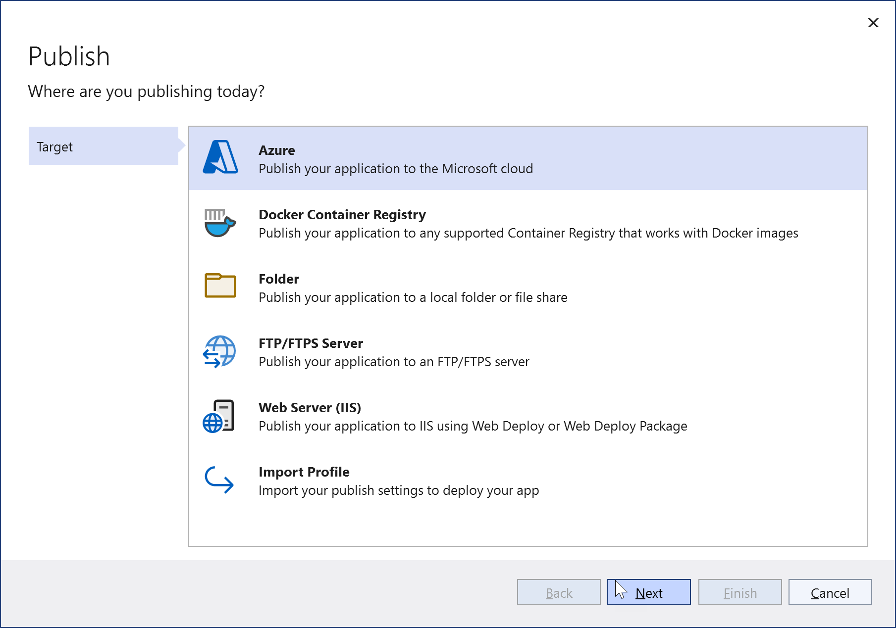
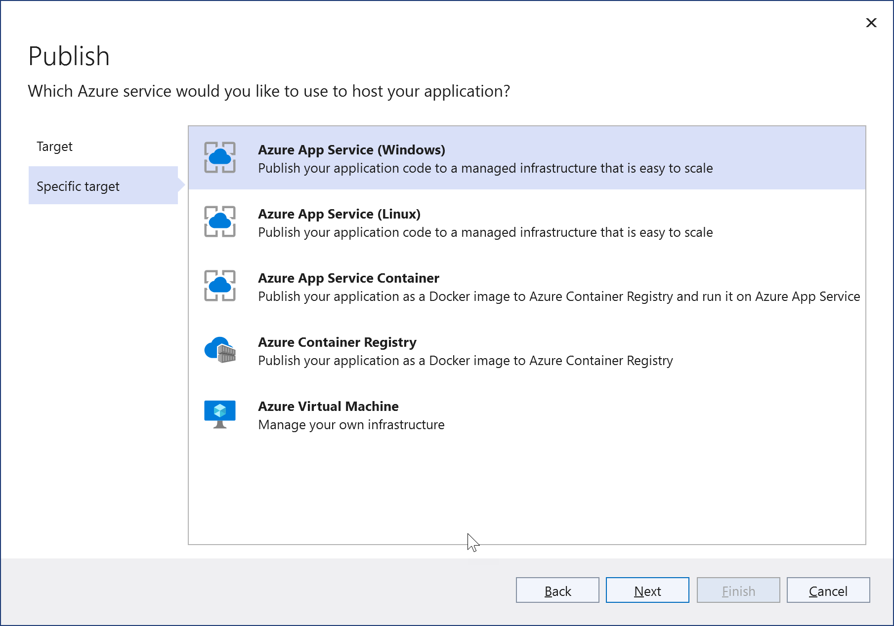
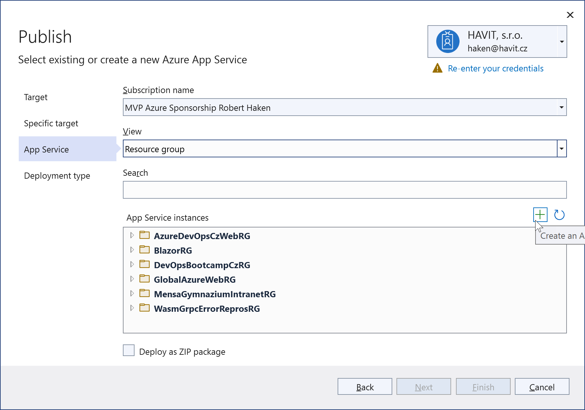
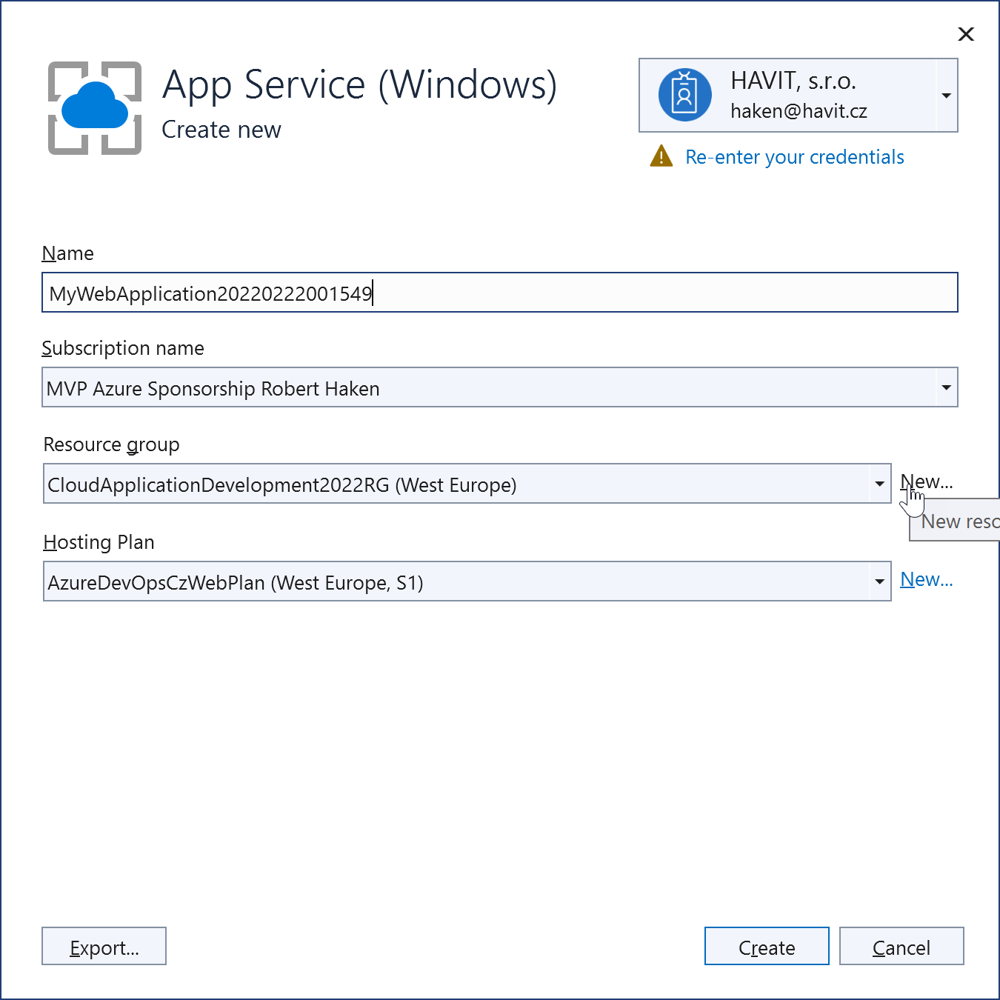
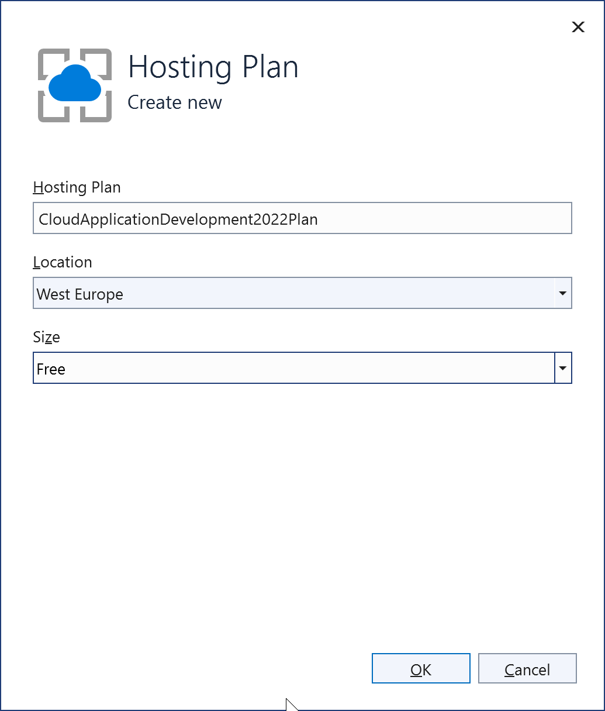
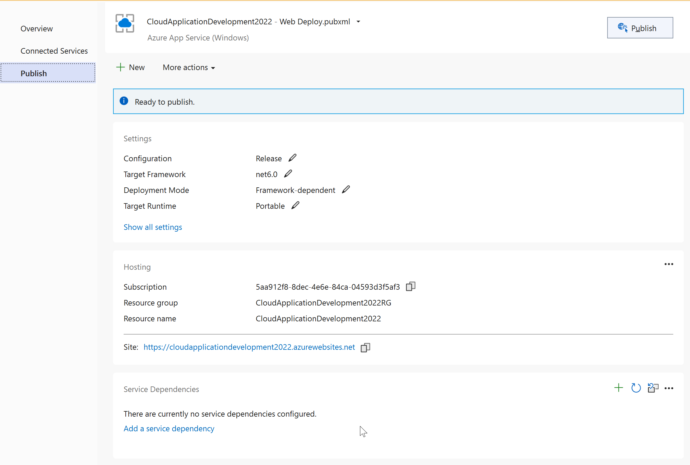

# LAB 1 - Create & Deploy simple Web Site to Azure App Service

1. Vytvořte jednoduchou webovou aplikaci ve Visual Studiu. Následujte tyto instrukce, nebo si založte projekt dle vlastních preferencí:

	1. Založte ve Visual Studiu 2022 nový projekt typu *ASP.NET Core Web App* (Razor Pages), pojmenujte ho dle vlastního uvážení.
	1. Prohlédněte si soubor `~/Pages/Index.cshtml` a vyměňte jeho obsah za nějaký vlastní, např.
		```html
		<div class="text-center">
			<h1 class="display-1">Hello NSWI152!</h1>
			<p>This is a sample page to be deployed...</p>
		</div>
		```
	1. Spusťe webovou aplikaci lokálně (<kbd>Ctrl</kbd>+<kbd>F5</kbd>), abyste ověřili její funkčnost.
1. Nasaďte webovou aplikace do Azure App Service:
	1. Klikněte na projekt v *Solution Exploreru* pravým tlačítkem myši a zvolte *Publish...*
		
    2. Zvolte *Azure*. V dalším kroku *Azure App Service (Windows)*.
		
    3. Nyní bude potřeba vytvořit novou Azure App Service tlačítkem <kbd>+</kbd>:
		
    4. Bude potřeba vytvořit novou resource group:
		
    5. ...a nový hosting plan:
		
	1. Doklikáním wizzardu do konce dojde k založení Resource Group, Azure App Service Planu i samotné Azure App Service. Profil pro nasazení (publikování) aplikace do Azure je připraven:
		
	1. Vpravo nahoře klikněte na tlačítko *Publish* a dojde k nasazení aplikace do Azure a zobrazení vzniklé website.
1. Změňte cokoliv na stránce `Index.cshtml` a nasaďte aplikaci znovu (již pouze kliknutím na tlačítko *Publish* v profilu).
1. [OPTIONAL] Prozkoumejte možnost nasazování přes *GitHub Actions*, které se vám nabízely v posledním kroku wizzardu.