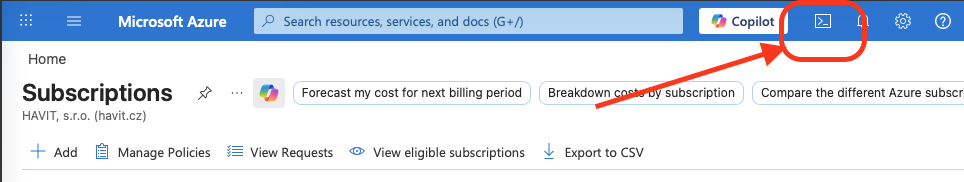
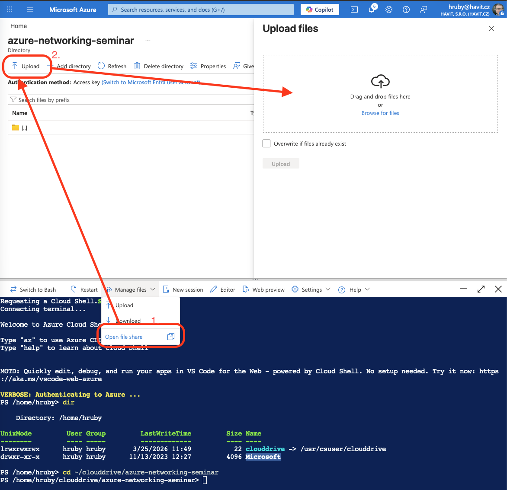
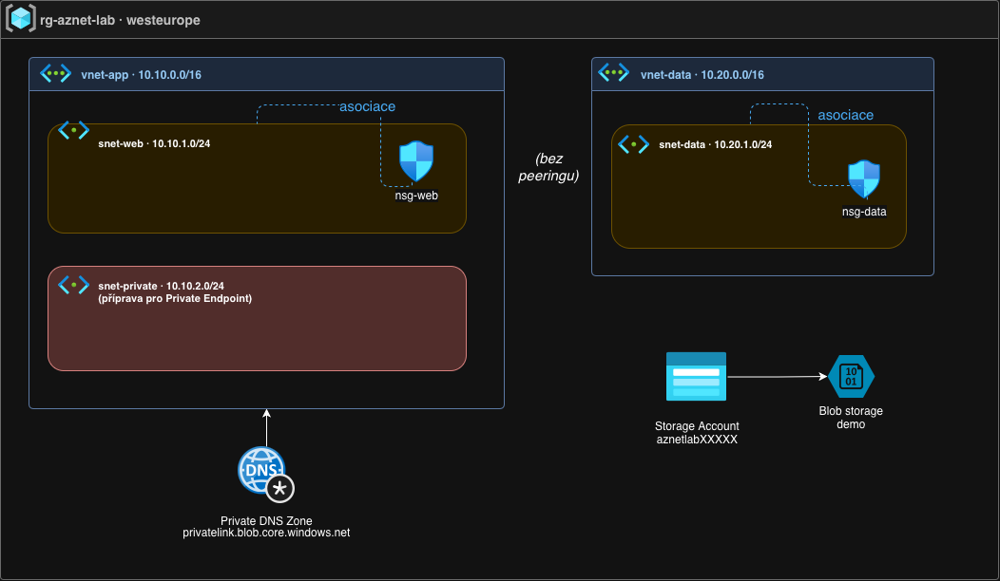
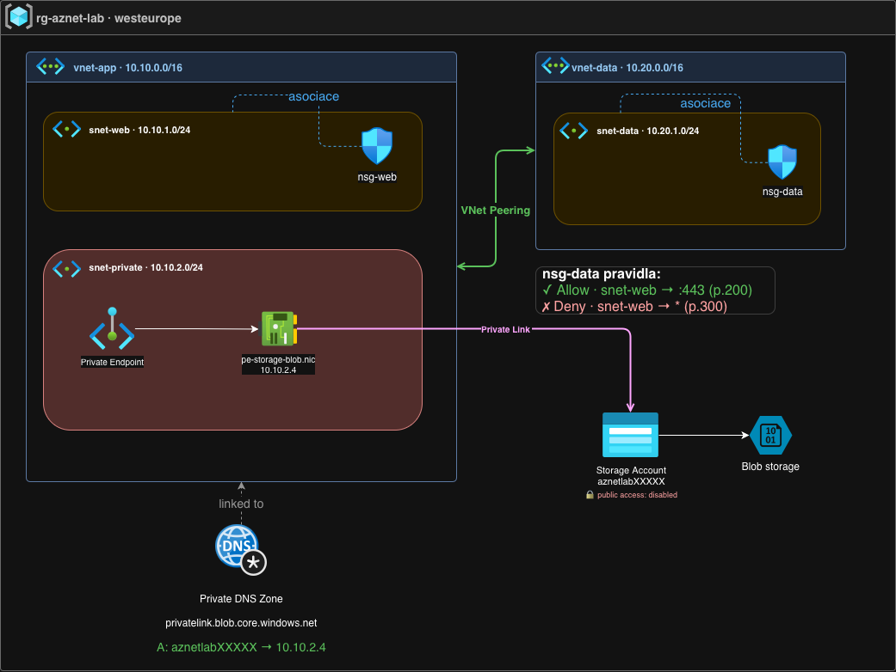
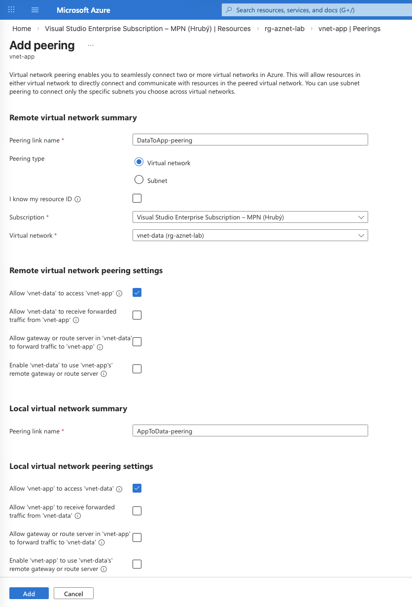
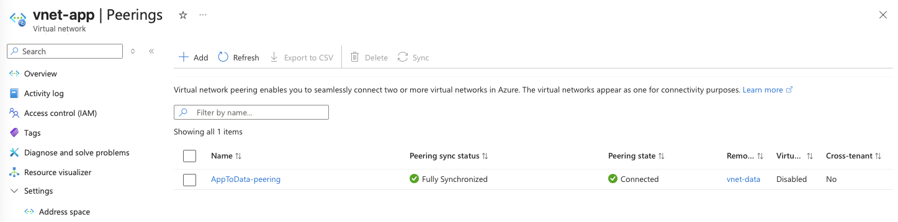
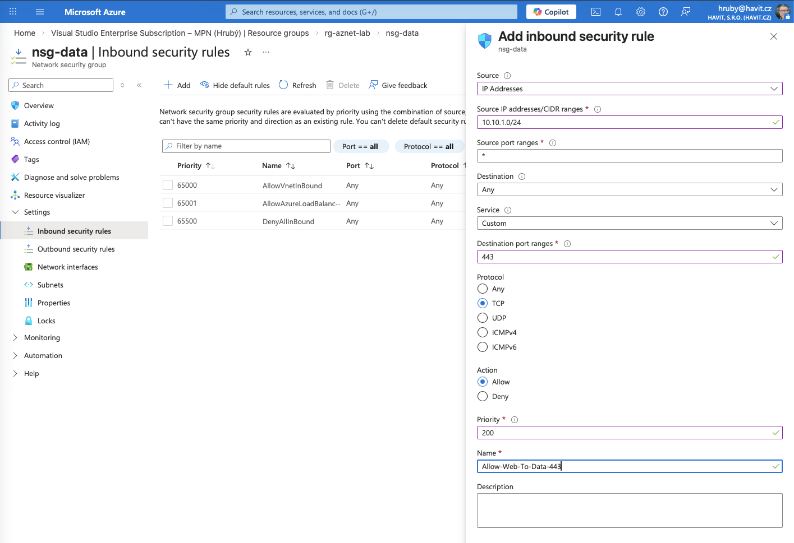
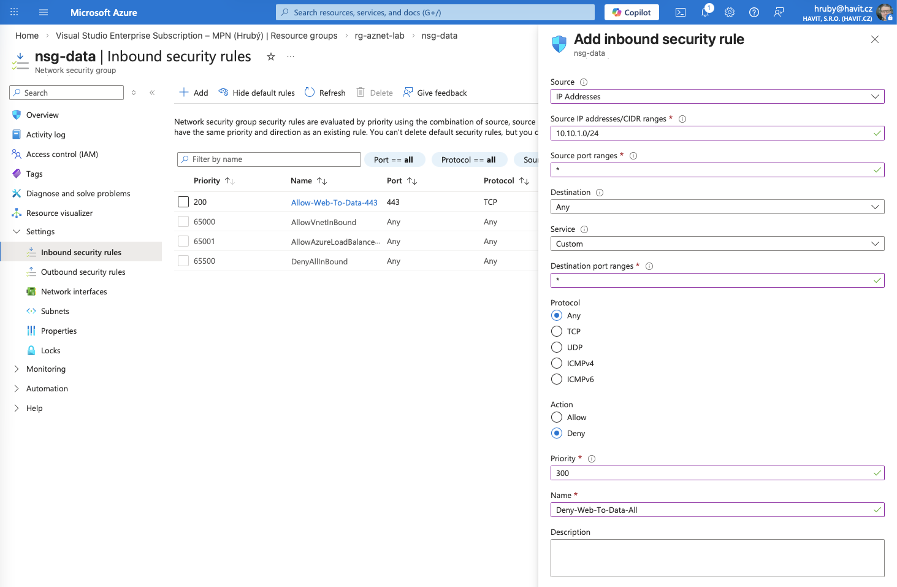
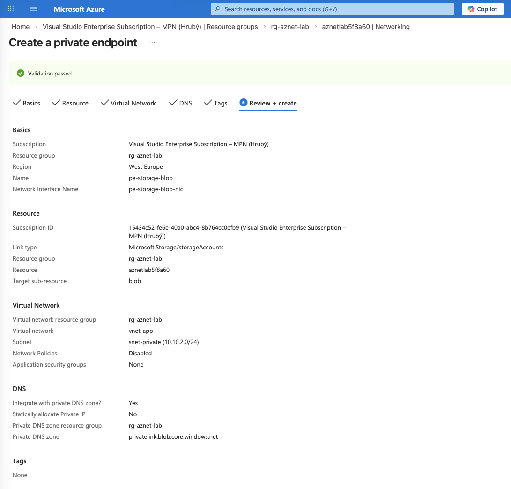
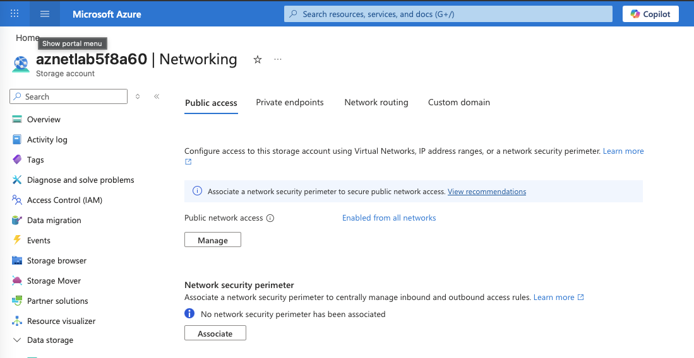

# LAB - Azure Networking: VNet, Peering, NSG a Private Link

V tomto cvičení si vyzkoušíme základní síťové stavební kameny Azure a jejich praktické použití při zabezpečení:

- **Virtual Network (VNet)** jako základní síťový prostor
- **subnety** jako logické členění uvnitř VNetu
- **VNet peering** pro propojení dvou sítí
- **NSG (Network Security Group)** pro řízení provozu
- **Private Link / Private Endpoint** pro privátní přístup ke službě Azure Storage

Budeme kombinovat:
- **Azure Portal** pro vizuální konfiguraci
- **Azure Cloud Shell** pro bootstrap a ověření prostředí
<br>

## Cíle Labu

Rozumět rozdílům mezi:

- **VNet** = síťová hranice
- **subnet** = logické členění uvnitř VNetu
- **peering** = konektivita mezi dvěma sítěmi
- **NSG** = pravidla, komunikace mezi subnety
- **Private Endpoint** = privátní síťový vstup ke konkrétní službě
- **Private Link** = mechanismus, kterým je služba dostupná privátně ve VNetu

<br>

# Část 1 - Připrava prostředí pomocí Azure Cloud Shell

Abychom se mohli soustředit na síťové principy a ne na mechanické zakládání resources, vytvoříme základní prostředí pomocí připraveného bootstrap skriptu.

## 1.1 Otevřete Azure Cloud Shell

1. Přihlaste se do **Azure Portalu**.
2. V horní liště klikněte na ikonu **Cloud Shell**.
3. Pokud Cloud Shell otevíráte poprvé, dokončete jeho inicializaci.
4. Můžete použít **PowerShell** nebo **Bash** prostředí.



## 1.2. Připravte si pracovní složku

V Cloud Shellu vytvořte pracovní adresář:
```bash
mkdir ~/clouddrive/azure-networking-seminar
cd ~/clouddrive/azure-networking-seminar
```

## 1.3 Upload skriptů
Manage files -> Open file share.

Překopírujte skripty: 
- 00-bootstrap.sh
- 01-verify.sh
- 99-cleanup.sh

Skripty se nahrají do složky ~/clouddrive/azure-networking-seminar odkud je budeme následně spouštět.




## 1.4 Spusťte bootstrap skript
```bash
./00-bootstrap.sh
```

Skript vytvoří:
- resource group
- dva VNety
- subnety
- 2x NSG
- Storage Account s demo blobem
- Private DNS zone pro Blob Private Link

## 1.5 Ověřte výsledek
Spusťte kontrolní skript:
```bash
./01-verify.sh
```

<br>
# Část 2 - Kontrola připraveného prostředí v Azure Portalu

Po doběhnutí `00-bootstrap.sh` v Azure Portalu otevřete resource group `rg-aznet-lab`

## Diagram prostředí



### 2.1 VNety
Máte připravené dva oddělené síťové prostory:

- `vnet-app`
- `vnet-data`

Tyto VNety zatím nejsou propojené.

### 2.2 Subnety
Ve VNetu `vnet-app` najdete:
- `snet-web`
- `snet-private`

Ve VNetu `vnet-data` najdete:
- `snet-data`

Subnet je **logické členění** uvnitř VNetu.  
Komunikace mezi subnety není blokována.

### 2.3 NSG (Network Security group)
Na vybrané subnety jsou už navázané:
- `nsg-web`
- `nsg-data`
Zatím v nich nejsou přidaná naše vlastní pravidla. Azure v každém NSG vytváří automaticky výchozí pravidla.

### 2.4 Ostatní Resource
- Storage Account
- Private DNS zone `privatelink.blob.core.windows.net` (zatím jen příprava)
<br>
<br>

# Cílový stav


### Co v tomto labu nakonfigurujeme a proč

Výchozí prostředí je záměrně nekompletní — sítě existují, ale nejsou propojené ani zabezpečené. V částech 3–8 postupně dobudujeme funkční a bezpečnou síťovou architekturu:

- **VNet Peering** (Část 3) — propojíme `vnet-app` a `vnet-data`, aby spolu mohly komunikovat. Bez peeringu jsou sítě zcela izolované.
- **NSG pravidla** (Část 4) — samotný peering by povolil veškerý provoz. Přidáme pravidla, která omezí komunikaci pouze na nezbytné porty (TCP 443), a vše ostatní zakážeme.
- **Private Endpoint** (Část 6) — místo veřejného endpointu Storage Accountu připojíme službu přímo do privátní sítě.
- **Zakázání veřejného přístupu** (Část 7) — bez tohoto kroku by Private Endpoint nedával bezpečnostní smysl, protože Storage Account by byl stále dostupný veřejně.
- **DNS** (Část 8) — aby aplikace mohla používat stejné logické jméno služby a přitom se uvnitř sítě přeložilo na privátní IP, je nutné správně nakonfigurovat Private DNS zónu.

Výsledkem je prostředí, kde:
- dvě sítě jsou propojené s řízeným provozem
- cloudová služba je dostupná pouze privátně, bez expozice na internet
<br>
<br>

# Část 3 - VNet Peering

Nyní vytvoříme **VNet peering** mezi `vnet-app` a `vnet-data`.

## 3.1 Vytvoření peeringu z `vnet-app` do `vnet-data` (a zpět)
Nastavuje se pro obě strany peeringu z jednoho místa:




1. Otevřete resource `vnet-app`
2. Přejděte do sekce **Peerings**
3. Klikněte na **Add**
4. Vytvořte propojení na `vnet-data`
<BR>
<BR>

- *Remote virtual network summary* = konfigurace cílového VNET směrem k "našemu" VNETu (Peering link name = DataToApp-peering)
- *Local virtual network summary* = konfigurace "našeho" VNETusměrem k peerovanému (Peering link name = AppToData-peering)


<BR>
<BR>

# Část 4 - NSG: povolení jen nezbytné komunikace

Samotný peering pro bezpečnou komunikaci nestačí. Potřebujeme určit, **jaký provoz je mezi sítěmi/subnety povolen**.

## Úloha
Chceme, aby:

- webová vrstva ve `snet-web` mohla komunikovat do data vrstvy ve `snet-data`
- **pouze na TCP portu 443**
- jiný provoz nechceme povolit!

## 4.1 Otevřete `nsg-data`


Přejděte do sekce v menu:
- **Inbound security rules**

## 4.2 Vytvořte pravidlo Allow



- **Source**: IP Addresses
- **Source IP addresses/CIDR ranges**: `10.10.1.0/24`
- **Source port ranges**: `*`
- **Destination**: Any
- **Service**: Custom
- **Destination port ranges**: `443`
- **Protocol**: TCP
- **Action**: Allow
- **Priority**: `200`
- **Name**: `Allow-Web-To-Data-443`

## 4.3 Vytvořte pravidlo Deny

Vytvořte další pravidlo, které zakazuje veškerou další komunikaci:

- **Source**: IP Addresses
- **Source IP addresses/CIDR ranges**: `10.10.1.0/24`
- **Source port ranges**: `*`
- **Destination**: Any
- **Service**: Custom
- **Destination port ranges**: `*`
- **Protocol**: Any
- **Action**: Deny
- **Priority**: `300`
- **Name**: `Deny-Web-To-Data-All`
<br>

-*Zpracování security rules probíhá postupně podle priority - první match končí zpracování dalších pravidel*<BR>
-*Při vytvoření VNETPeering se automaticky přidá i pravidlo které naopak komunikaci mezi VNETy povoluje ( priority 6500)*

<BR>

# Část 5 - Azure Storage a Blob endpoint

Pro další část labu máme připravený Storage Account s demo blobem.

Bootstrap skript vytvořil:
- Blob container `demo`
- blob `readme.txt`

Na konci skriptu `00-bootstrap` byla vypsána také:
- **Blob service endpoint**
- **Blob URL**

Typicky ve tvaru:
https://<storage-account>.blob.core.windows.net/
https://<storage-account>.blob.core.windows.net/demo/readme.txt

# Část 6 - Private Endpoint

Rozdílný scénář než v případě peeringu:

- nepropojujeme dvě sítě mezi sebou
- ale připojujeme **konkrétní službu** privátně do sítě

## 6.1 Vytvoření Private Endpointu

Otevřete v Azure Portalu váš **Storage Account** (vytvořený bootstrap skriptem).

Přejděte do:
- **Security + networking → Networking → Private endpoint**
- Klikněte na **+ Create Private endpoint**

### Záložka Basics
- **Resource group**: `rg-aznet-lab`
- **Name**: `pe-storage-blob`
- **Network interface name**: `pe-storage-blob-nic`
- **Region**: stejný region jako VNet (West Europe)

### Záložka Resource
- **Connection method**: Connect to an Azure resource in my directory
- **Resource type**: `Microsoft.Storage/storageAccounts`
- **Resource**: váš Storage Account
- **Target sub-resource**: `blob`

### Záložka Virtual Network
- **Virtual network**: `vnet-app`
- **Subnet**: `snet-private`
- **Private IP configuration**: Dynamically allocate IP address

### Záložka DNS
- **Integrate with private DNS zone**: Yes
- **Private DNS zone**: `privatelink.blob.core.windows.net`

> Tato DNS zóna byla připravena bootstrap skriptem. Integrace zajistí, že se název Storage Accountu uvnitř sítě přeloží na privátní IP.

Pokračujte přes **Review + create** → **Create**.



## 6.2 Zkontrolujte, co vzniklo

Po vytvoření Private Endpointu si v resource group `rg-aznet-lab` všimněte nových resources:

- **Private Endpoint** `pe-storage-blob`
- **Network Interface (NIC)** — Azure ji vytvořil automaticky
- NIC má přiřazenou **privátní IP** z rozsahu subnetu `snet-private`

Ověřte DNS záznam v portálu:
1. Otevřete **Private DNS zone** `privatelink.blob.core.windows.net`
2. V sekci **Virtual network links** ověřte, že existuje link na `vnet-app` — bez něj zóna pro zdroje v síti není viditelná
3. V sekci **DNS recordsets** uvidíte A záznam s názvem vašeho Storage Accountu směřující na privátní IP (z rozsahu `10.x.x.x`) — tento záznam Azure vytvořil automaticky při vytvoření Private Endpointu

Spustťe jesště jednou `01-verify.sh` a zkontrolujte sekci DNS - resolving by měl ukazovat na interní rozsah, ale neukazuje :-) 

> **Proč verify skript přesto ukazuje veřejnou IP?**
>
> DNS záznam v portálu je správně — A záznam na privátní IP existuje. Problém je v tom, **odkud** se dotazujete.
>
> Cloud Shell neběží uvnitř tvého VNetu — používá Microsoft-spravovanou síť. Jeho DNS dotazy jdou přes veřejný Azure DNS, který vaši Private DNS zónu nevidí, a přeloží název na veřejnou IP.
>
> CNAME řetěz ve výstupu skriptu je přesto správně:
> `blob.core.windows.net` → `blob.privatelink.core.windows.net`
> To znamená, že Private Endpoint existuje a je správně přiřazen. Chybí jen poslední překlad na privátní IP, protože Cloud Shell stojí mimo váš VNet.
>
> Pro skutečný funkční test by bylo potřeba VM uvnitř `vnet-app` — z ní by `nslookup` vrátil privátní IP místo veřejné.

# Část 7 - Zakázání veřejného přístupu ke Storage Accountu

Aby dával celý scénář bezpečnostní smysl, je potřeba zakázat veřejný přístup ke Storage Accountu. Bez tohoto kroku by byl Storage Account stále dostupný z internetu i přesto, že máme Private Endpoint.

## 7.1 Zakažte public network access

Nejprve zkuste v prohlížeči otevřít Blob URL ze sekce 5:
```
https://<storage-account>.blob.core.windows.net/demo/readme.txt
```

Následně proveďte změny:




1. Otevřete váš **Storage Account**
2. Přejděte do **Security + networking → Networking**
3. Otevřete záložku **Public access**
4. Klikněte na **Manage**
5. Nastavte **Public network access**: `Disable`
6. Klikněte na **Save**

## 7.2 Ověřte, že veřejný přístup nefunguje

Zkuste v prohlížeči opět otevřít Blob URL:
```
https://<storage-account>.blob.core.windows.net/demo/readme.txt
```

Měli byste obdržet chybu `AuthorizationFailure` — Storage Account již z internetu není dostupný.

<br>

# Část 8 - DNS a Private Link

Aplikace obvykle stále používá stejné logické jméno služby a ani po vytvoření Private linku není potřeba nic měnit:

```
https://<storage-account>.blob.core.windows.net
```

Po vytvoření Private Endpointu a správném DNS se tento název uvnitř sítě přeloží přes `privatelink.blob.core.windows.net` na privátní IP Private Endpointu — bez jakékoli změny v kódu aplikace.

<BR>

# Část 9 - Shrnutí

V laboratoři jsme si ukázali dvě různé situace:
## Scénář 1. Propojení dvou sítí
Použili jsme:
- VNet
- subnety
- VNet peering
- NSG
## Scénář 2. Privátní přístup ke konkrétní službě
Použili jsme:
- Azure Storage
- Blob endpoint
- Private Endpoint
- Private DNS zone
- omezení public network access

Hlavní závěry
- VNet je síťová hranice
- subnet je logické členění uvnitř VNetu
- peering řeší konektivitu
- NSG řeší bezpečnostní politiku
- Private Link řeší privátní přístup ke službě
- DNS je u Private Linku klíčová část návrhu

<BR>

# Část 10 - Úklid prostředí

Po skončení laboratoře můžete smazat veškeré resources group pomocí cleanup skriptu:
`99-cleanup.sh` nebo smazáním Resource group v administračním UI.

<BR>

# Otázky k zamyšlení
- Kdy by stačil jeden VNet a více subnetů, a kdy už dává smysl více VNetů?
- Proč peering sám o sobě neřeší bezpečnost?
- Jaký je rozdíl mezi Private Endpoint a Service Endpoint?
- Proč u Private Linku nestačí jen vytvořit endpoint a je potřeba řešit i DNS?
- Proč je rozdíl mezi public endpointem omezeným firewallem a private-only přístupem?