# LAB2 - Azure SQL & Azure WebJob

Navážeme na projekt, který vznikl v [LAB1](../Lab1-AzureWebSiteDeployment/).

1. Založíme a nasadíme Azure WebJob:
   1. V *Solution Exploreru* přidejte do solution nový projekt typu *Console Application* (.NET6 nebo novější).
   1. Klikneme v *Solution Exploreru* pravým tlačítkem na nový projekt a vybereme volbu *Publish*.
   1. Zvolíme jako target *Azure*.
   4. V dalším kroku zvolíme specific target *Azure WebJobs*:
      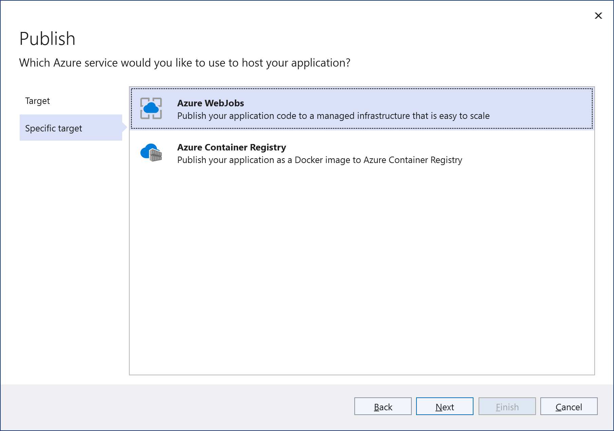
   5. V dalším kroku vybereme Azure App Service, kterou jsme si vytvořili pro website z LAB1.
   6. Dokončíme průvodce, vznikne publish-profile pro nasazování web-jobu:
		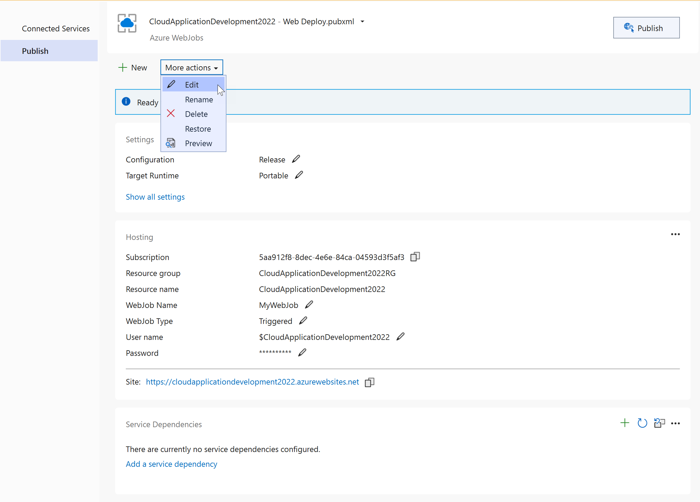
   7. V podrobném nastavení profilu změníme typ jobu na  *Continuous*:
		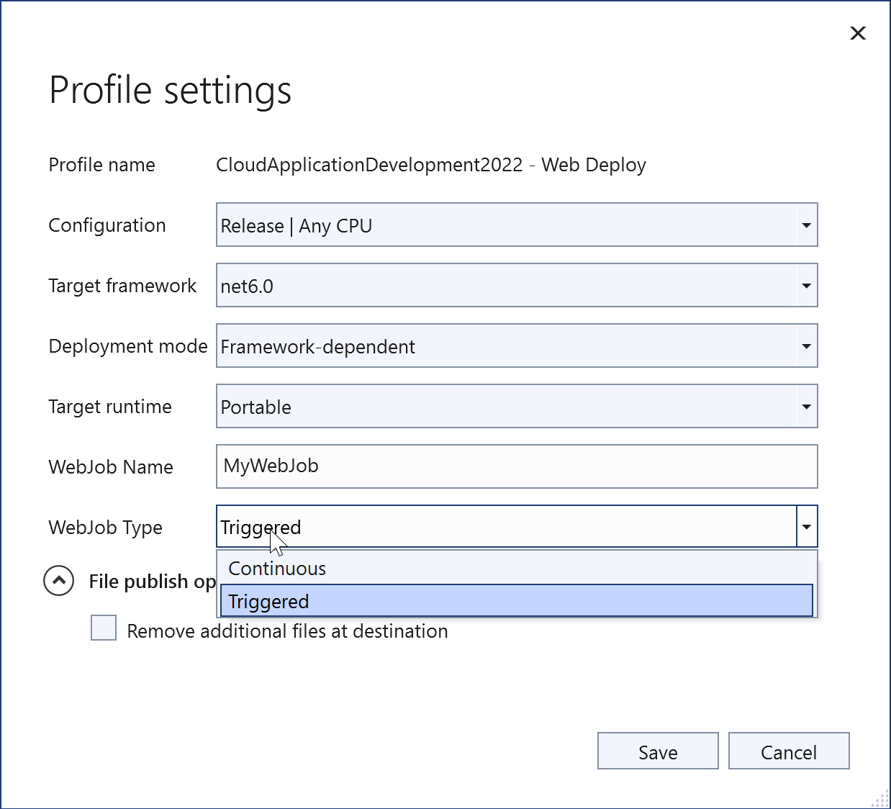

1. Založíme Azure SQL databázi.

   SQL Databázi by bylo možné přidat k publish-profilu WebJobu jako *Service Dependency*, kde by nám to připravilo i konfigurační volby do hostující Azure App Service, nicméně my si nyní vyzkoušíme další z cest zakládání Azure resources, a to přímo z Azure Portalu:
   1. Jdeme na Azure Portal (https://portal.azure.com) a najdeme si resource group, do které jsme nasadili naší website.
		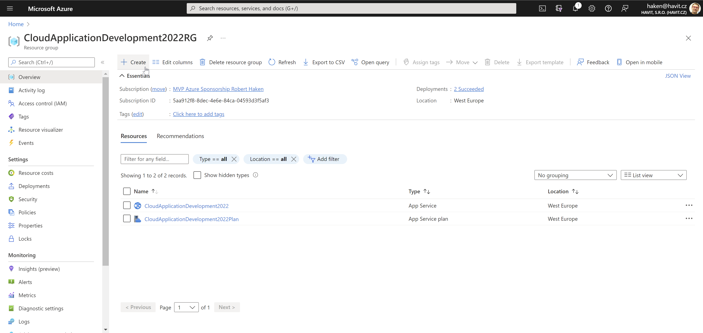
	2. Vytvoříme nový resource typu *Azure SQL* (v UI pod názvem *SQL Database*). **Zvolíme nejlevnější *Compute + Storage* variantu Basic 5 DTU (4.21€/mo).** 
        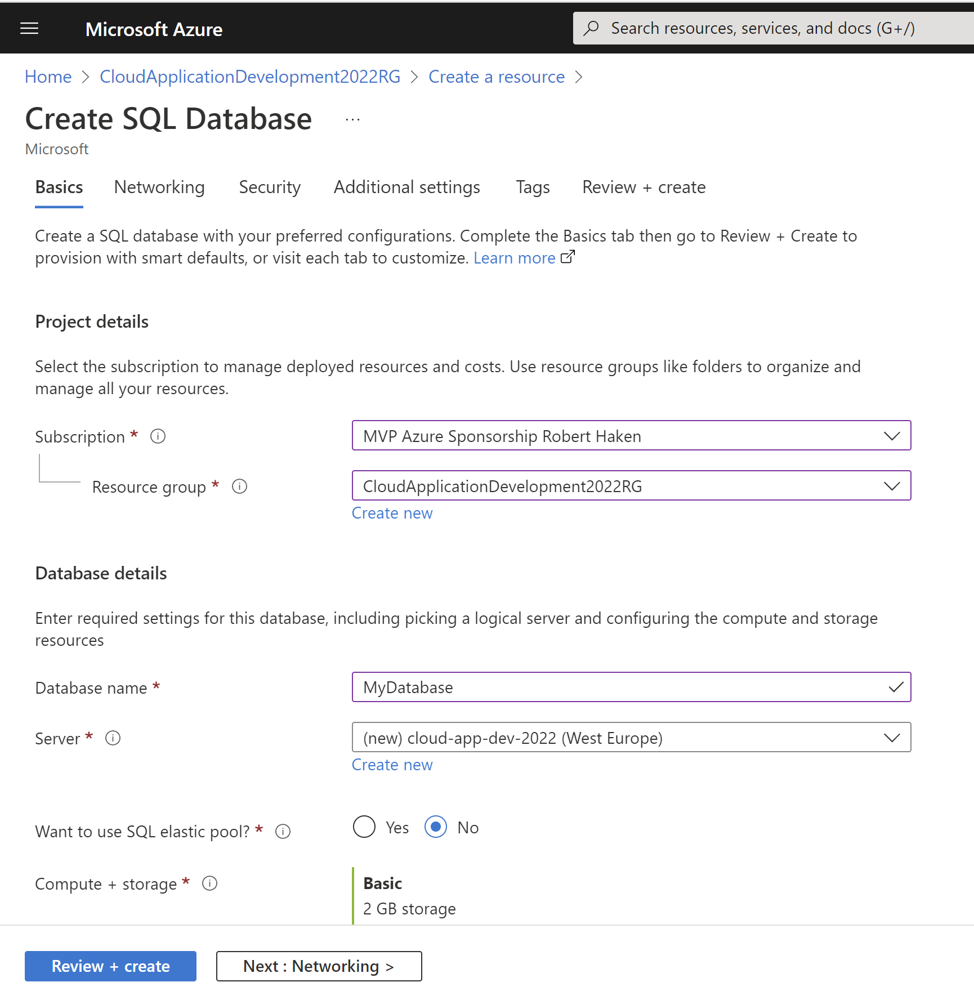
    3. V rámci zakládání databáze potřebujeme založit nový *SQL server*.
		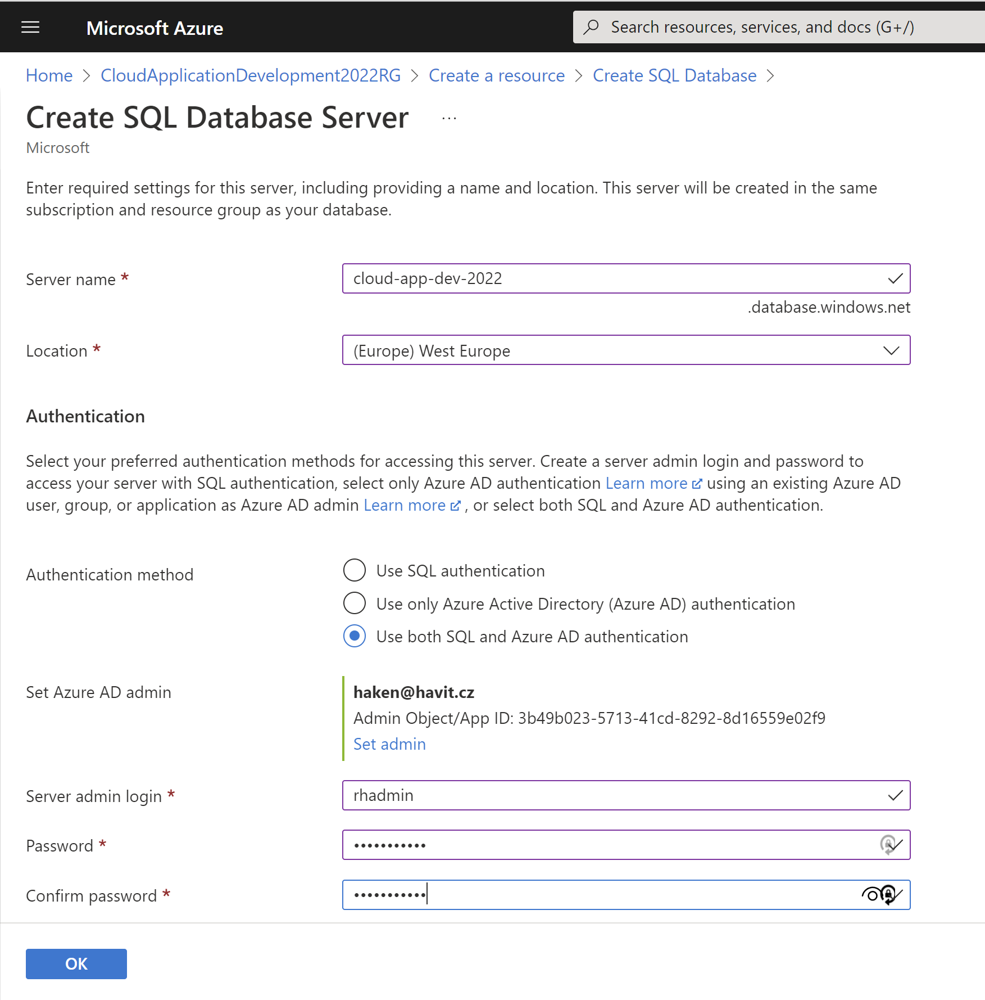
	1. V dalších krocích průvodce si prostudujte možné volby při zakládání SQL, všude můžete ponechat výchozí nastavení, aktivujeme pouze volbu _Public endpoint_ s nastavením _Firewall rules:_ *Allow Azure services and resources to access this server* a _Add current client IP address_ (kdo by nyní zapomněl, najde ji později v sekci *Firewalls and virtual networks* v nastavení založeného Azure SQL Serveru).


1. Připojíme se k Azure SQL z Visual Studia a připravíme schéma databáze:
	1. Ve Visual Studiu otevřete *SQL Server Object Explorer* (najdete např. přes *Quick Search*).
    2. Přidejte si mezi registrované servery server právě vyvořený:
       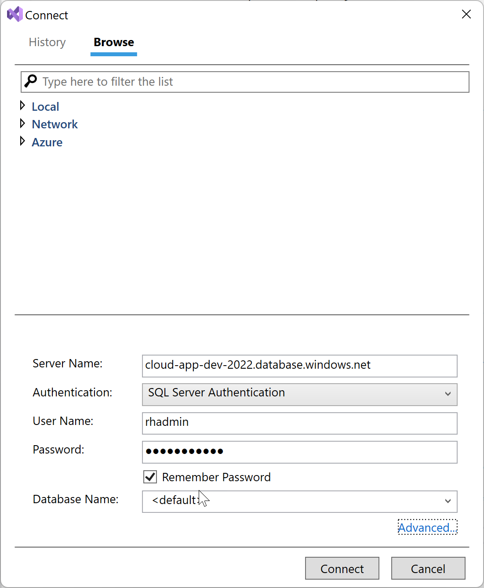
    3. V průběhu bude potřeba přidat firewall pravidlo:
       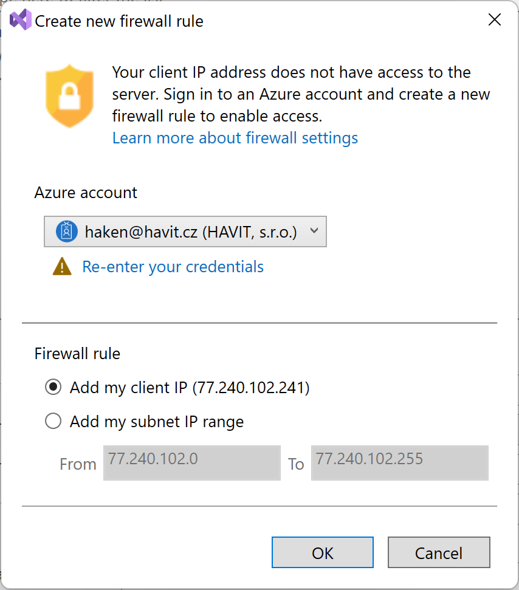
    4. Otevřte si New Query vůči založené databázi a spusťte následující skript pro založení tabulky EmailQueue:
		```sql
		CREATE TABLE dbo.EmailQueue (
			ID int PRIMARY KEY NOT NULL IDENTITY (1, 1),
			Recipient nvarchar(MAX) NOT NULL,
			Subject nvarchar(400) NOT NULL,
			Body nvarchar(MAX) NOT NULL,
			Created datetime NOT NULL,
			Sent datetime NULL
		)
		```

1. WebJobu dáme úkol hlídat obsah emailové fronty v SQL databázi a posílat maily, které se tam objeví

```csharp
using Microsoft.Extensions.Configuration;
using Microsoft.Extensions.DependencyInjection;
using Microsoft.Extensions.Hosting;
using Microsoft.Extensions.Logging;
using System.Data.SqlClient;
using System.Net;
using System.Net.Mail;

public class Program
{
	static async Task Main(string[] args)
	{
		// Setup Host
		var host = Host.CreateDefaultBuilder()
			.ConfigureAppConfiguration(app =>
			{
				app.AddJsonFile("appsettings.json");
				app.AddEnvironmentVariables();
			})
			.ConfigureServices(services =>
			{
				services.AddHostedService<Worker>();
			})
			.Build();

		await host.RunAsync();
	}
}

public class Worker : IHostedService, IDisposable
{
	private PeriodicTimer? timer;
	private readonly IConfiguration configuration;

	public Worker(IConfiguration configuration)
	{
		this.configuration = configuration;
	}

	public async Task StartAsync(CancellationToken stoppingToken)
	{
		Console.WriteLine("Worker started...");

		timer = new PeriodicTimer(TimeSpan.FromSeconds(10));

		do
		{
			await ProcessEmailQueueAsync(stoppingToken);

			Console.WriteLine("Waiting for next tick...");
		}
		while (await timer.WaitForNextTickAsync(stoppingToken));
	}

	private async Task ProcessEmailQueueAsync(CancellationToken stoppingToken)
	{
		Console.WriteLine("Checking for new e-mails to be sent...");

		using var conn = new SqlConnection(configuration.GetConnectionString("MyDatabase"));
		await conn.OpenAsync(stoppingToken);

		var cmd = new SqlCommand("SELECT * FROM EmailQueue WHERE Sent IS NULL", conn);

		using var reader = await cmd.ExecuteReaderAsync(stoppingToken);

		while (await reader.ReadAsync(stoppingToken))
		{
			Console.WriteLine($"Email ID:{reader["ID"]} found...");

			string recipients = reader["Recipient"].ToString() ?? throw new InvalidOperationException("Recipient not provided");
			string? subject = reader["Subject"].ToString();
			string? body = reader["Body"].ToString();
			int mailId = Convert.ToInt32(reader["ID"]);

			await SendMailAsync(recipients, subject, body, mailId, stoppingToken);
		}
	}

	private async Task SendMailAsync(string recipients, string? subject, string? body, int mailId, CancellationToken stoppingToken)
	{
		using var smtpClient = new SmtpClient();
		smtpClient.Host = configuration.GetValue<string>("MailSettings:SmtpHost");
		smtpClient.Credentials = new NetworkCredential(configuration.GetValue<string>("MailSettings:SmtpUsername"), configuration.GetValue<string>("MailSettings:SmtpPassword"));

		await smtpClient.SendMailAsync(
			from: configuration.GetValue<string>("MailSettings:SmtpFrom"),
			recipients: recipients,
			subject: subject,
			body: body,
			stoppingToken);

		// mark mail as sent
		using var conn = new SqlConnection(configuration.GetConnectionString("MyDatabase"));
		await conn.OpenAsync(stoppingToken);
		var cmd = new SqlCommand("UPDATE EmailQueue SET Sent = GETDATE()  WHERE Id = @ID", conn);
		cmd.Parameters.AddWithValue("@Id", mailId);
		await cmd.ExecuteNonQueryAsync();

		Console.WriteLine($"Email ID:{mailId} sent...");
	}

	public Task StopAsync(CancellationToken stoppingToken)
	{
		return Task.CompletedTask;
	}

	public void Dispose()
	{
		timer?.Dispose();
	}
}
```

Výše uvedený kód je psán formou čisté konzolové aplikace (s využitím `IHost`). Prostuduj možnosti využití Azure WebJobs SDK: https://docs.microsoft.com/en-us/azure/app-service/webjobs-sdk-how-to

## Konfigurace
Zdrojové kódy WebJobu se odkazují na konfigurační volby, které potřebujeme aplikaci poskytnout.

1. Pro lokální testování a vývoj je možné použít přímo `appSettings.json` soubor v projektu. Příklad:
   ```json
   {
		"ConnectionStrings": {
			"MyDatabase": "Server=(localdb)\\mssqllocaldb;Database=MyDatabase;Trusted_Connection=True;"
		},
		"MailSettings": {
			"SmtpHost": "mail.havit.local",
			"SmtpFrom": "cloud-dev-app@devmail.havit.cz",
			"SmtpUsername": null,
			"SmtpPassword": null
		}
	}
   ```
2. Abychom nemuseli produkční konfiguraci udržovat v repozitáři zdrojových kódů nebo jinak zařizovat při nasazování (např. skrze `appSettings.Production.json`), využijeme možnost injectování konfigurace přímo v Azure App Service v sekci *Configuration* (první záložka *Application Settings*):
	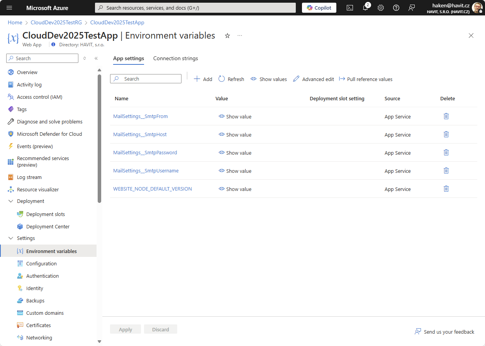

	Na některé z pozdějších lekcí uvidíte ještě možnosti služby *Azure Key Vault*, která slouží k bezpečnému uchovávání secrets pro aplikace.

## Publish
1. Nyní můžeme WebJob vypublikovat (pravým tlačítkem na project v *Solution Exploreru*, volba *Publish*).
2. WebJob si můžeme zkontrolovat v Azure Portal v cílové Azure App Service, v sekci WebJobs:
	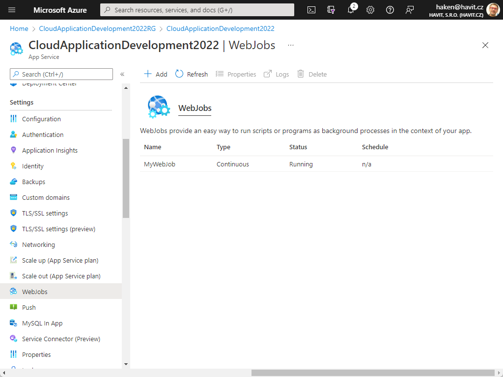

## Test funkčnosti
1. Pro vložení testovacího záznamu do DB můžeme použít Query Exploreru v Azure Portale, který je u Azure SQL Database k dispozici:
	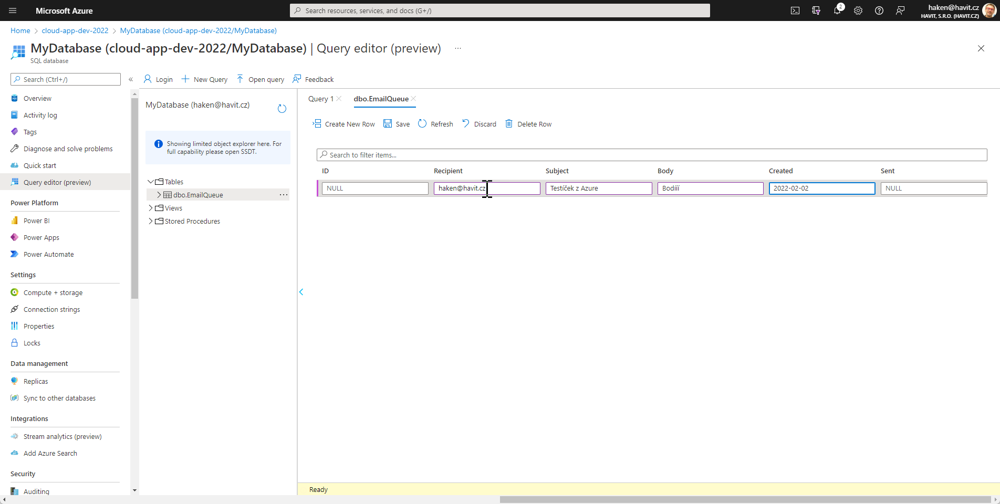
2. Za pozozrnost stojí volba *Logs*, kde si můžete prohlížet konzolový výstup (stdout) WebJob aplikace.
3. Sofistikovanější dashboard WebJobů je možné získat při použití WebJobs SDK, popř. lze využít i alternativní job-schedullery (Hangfire, Quartz.NET, atp.)
