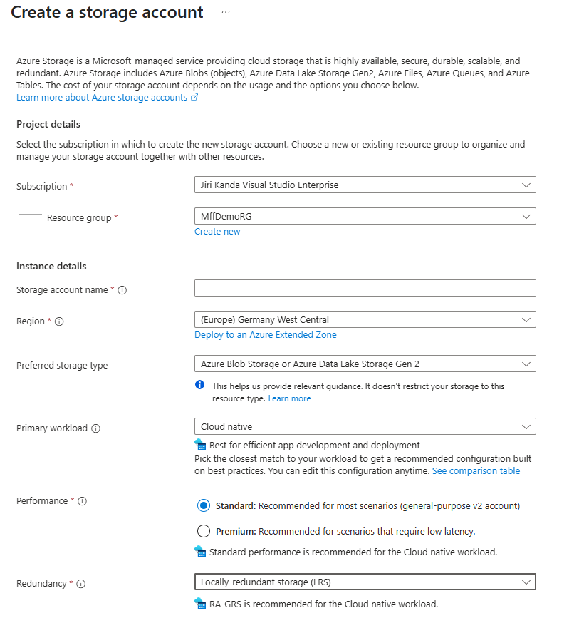
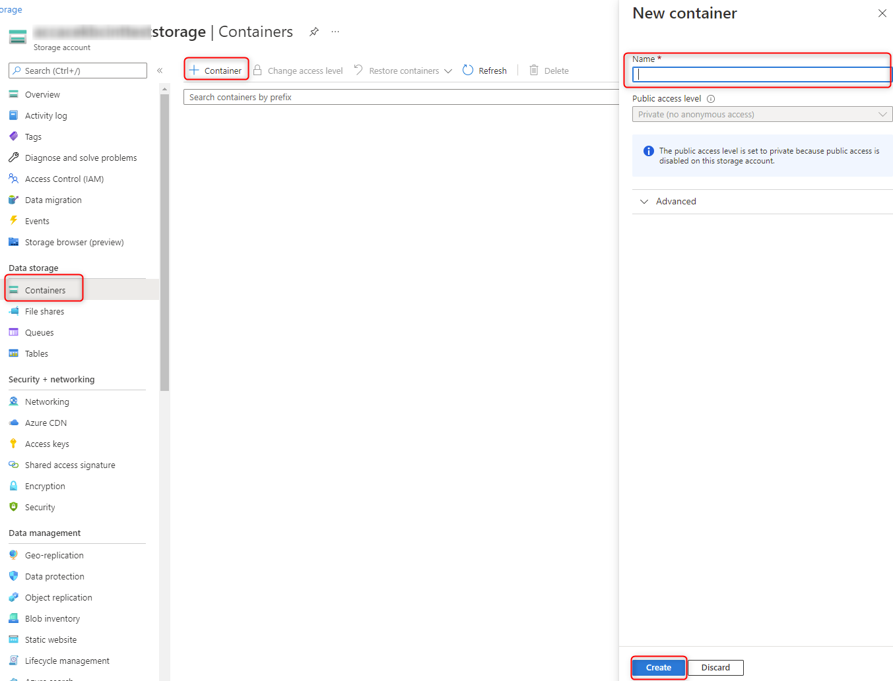
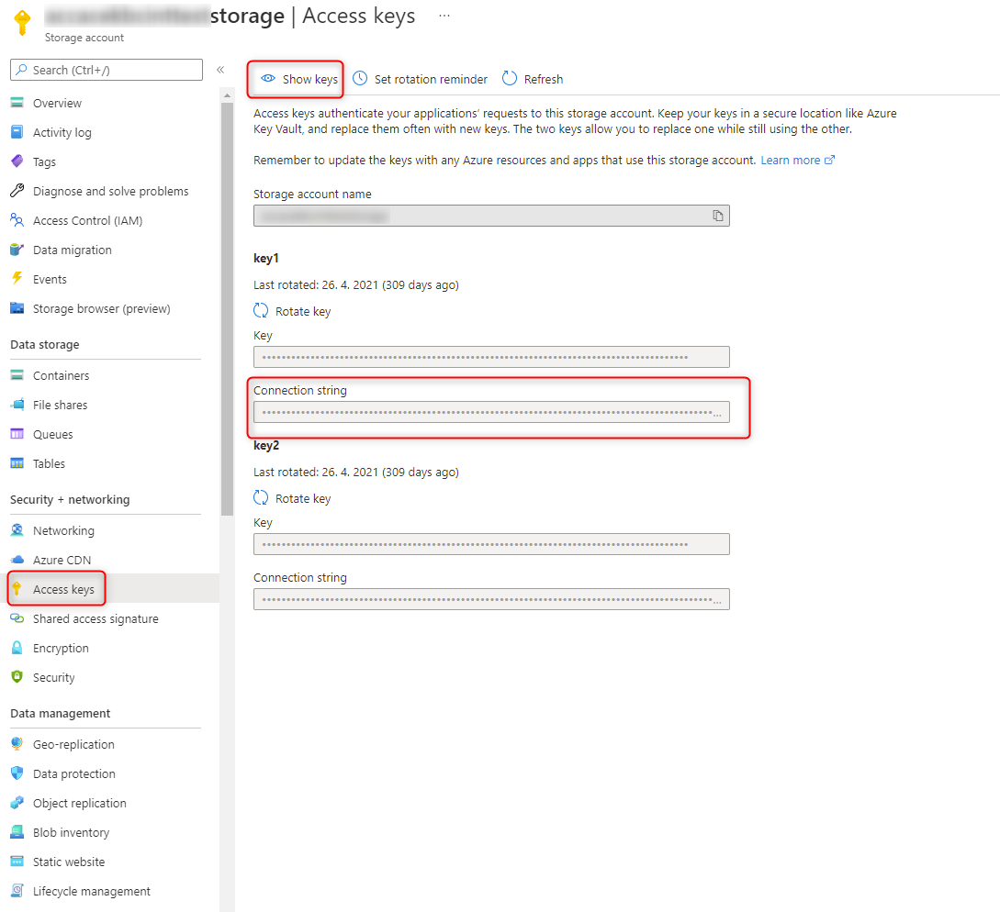

# LAB3 - Azure Blob Storage

Navážeme na projekt, který vznikl v [LAB1](../Lab1-AzureWebSiteDeployment/).

* Založíme Azure Storage a (neveřejný) container
* Do aplikace doplníme funkcionalitu zobrazení seznam blobů v containeru
* Dáme možnost stažení souboru (skrz aplikaci)

1. Připravíme Azure Storage
   1. Založíme Azure Storage. Vyplníme: 

	* Název storage (lowercase, 3-24 znaků, pouze písmena a číslice)
	* Lokalita
	* Preferred storage type (Azure Blob Storage or Azure Data Lake Storage Gen 2)
	* Primary workload (Cloud native)
	* Performance (Standard)
	* Redundancy (Locally-redundant storage (LRS))
	
      Ostatní hodnoty mohou zůstav ve výchozím nastavení.

	

	2. Vytvoříme container
	
	3. Do aplikace budeme potřebovat ještě connection string.
	

1. Doplníme do aplikace funkcionalitu:
	1. Nainstalujeme nuget balíček Azure.Storage.Blobs
	1. Upravíme Index.cshtml a Index.cshtml.cs (viz zdrojové kódy aplikace)
	1. Dopravíme do kódu connection string a název containeru.
