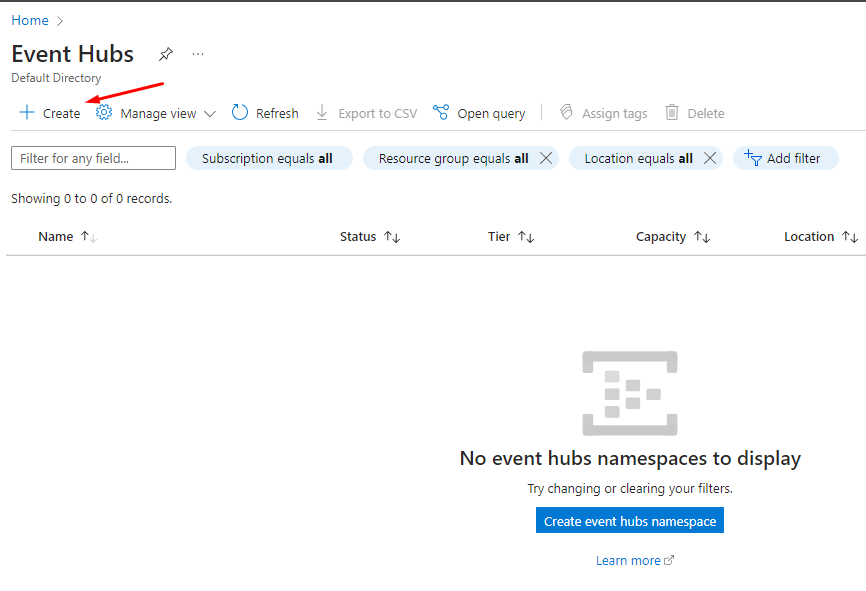
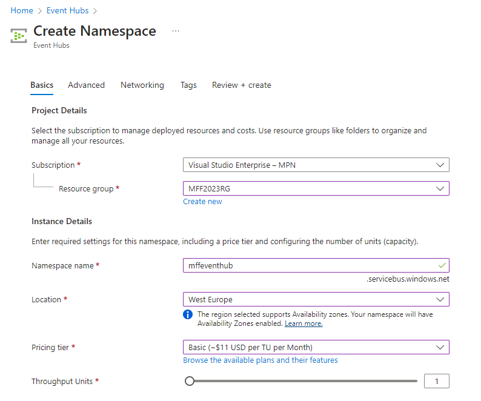
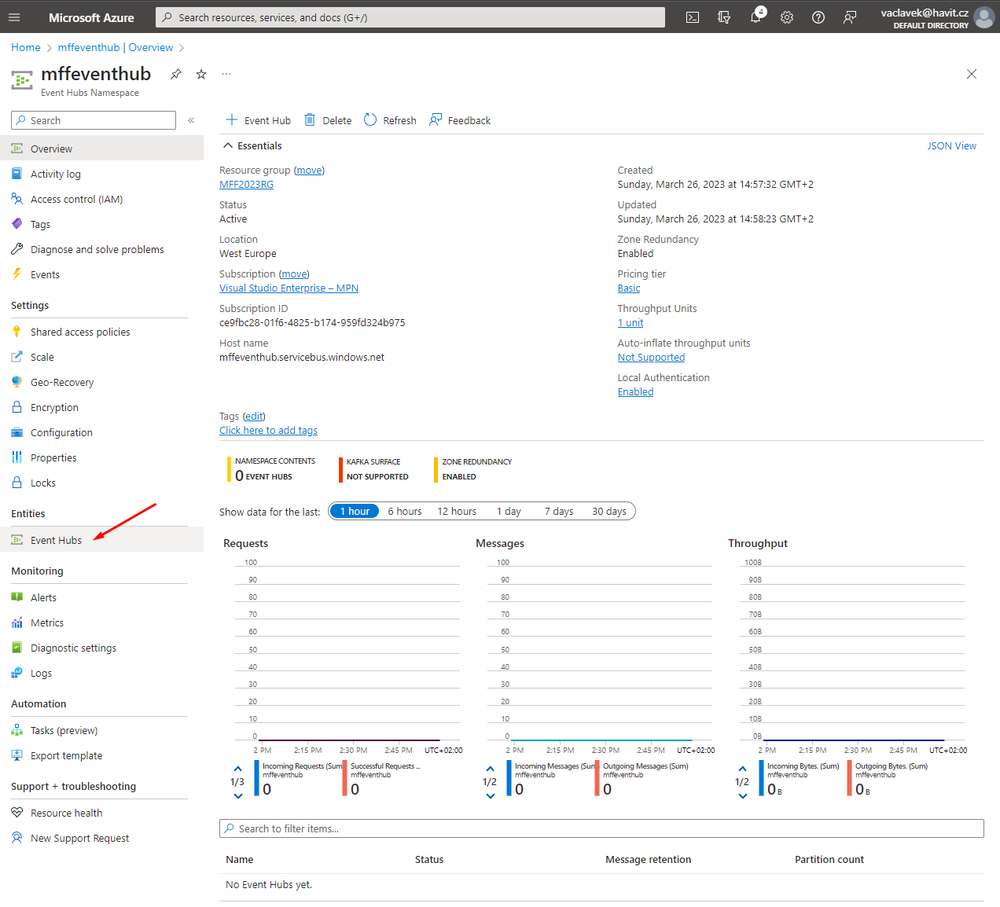
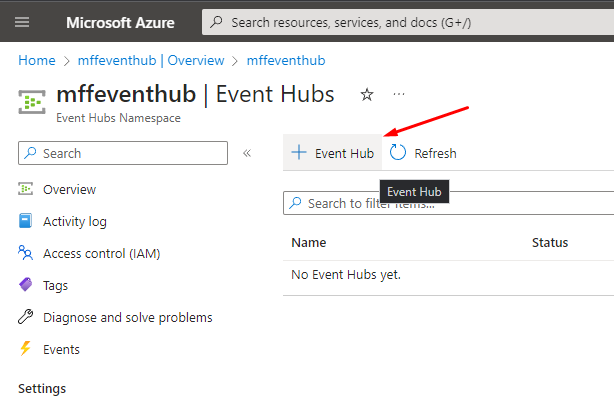
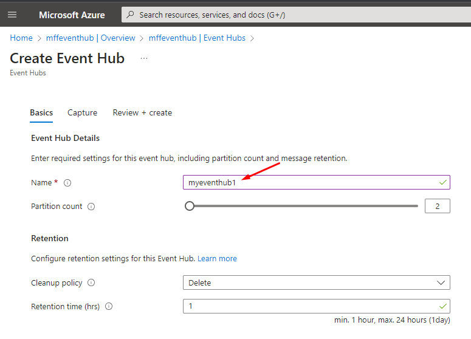
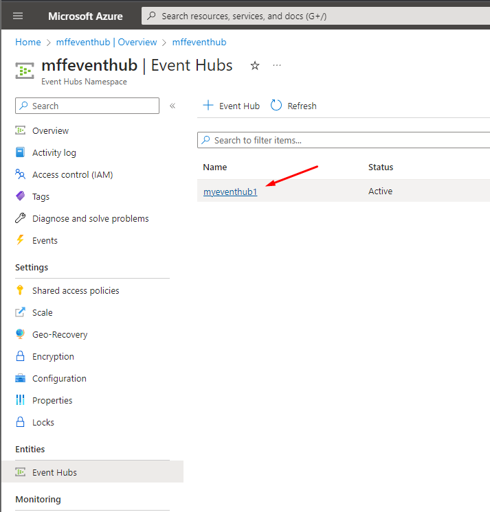
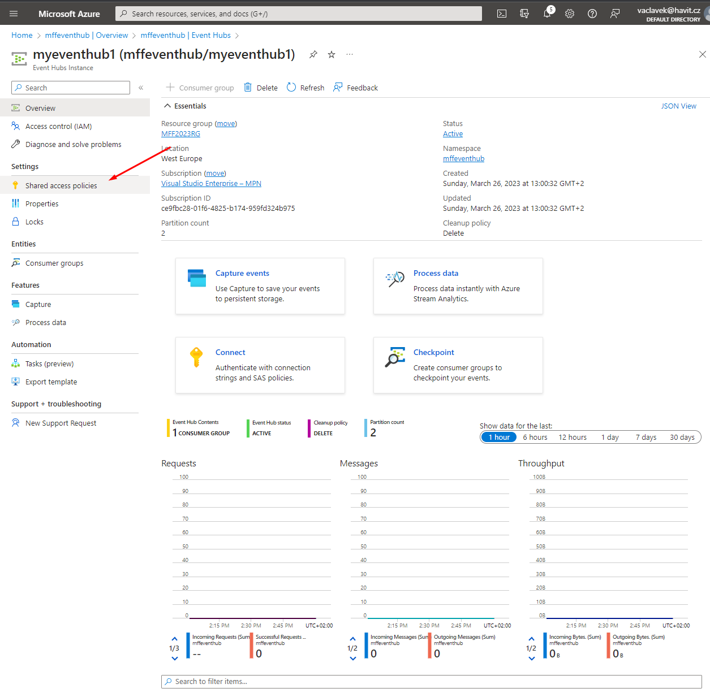
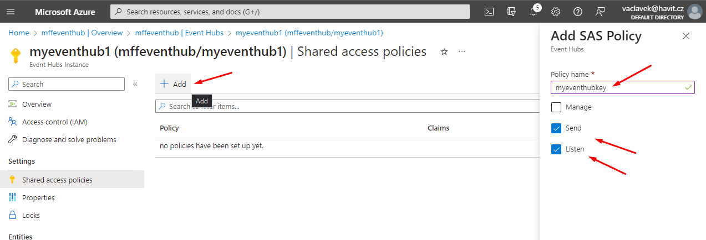
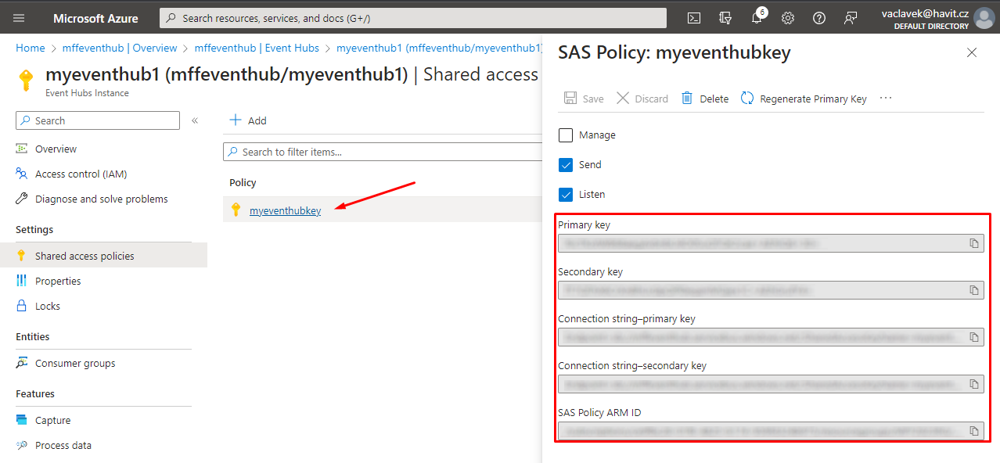
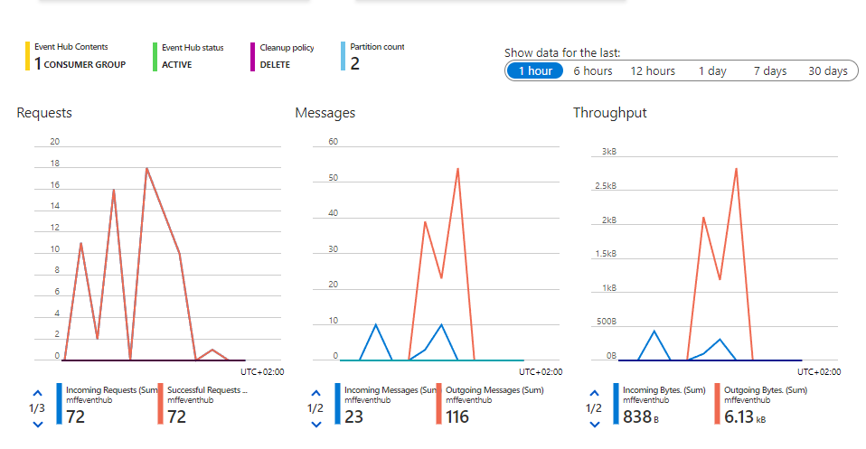

# LAB 7a - Vyvoření Event Hubu a použití

*Zadání: Založte v Azure nový Event Hub, připojte se do něj z Visual Studia, vypublikujte do něj novou událost a tuto přečtěte. Prozkoumejte Event Hub v Azure Portále.*

1. V Azure Portále najděte založte nový resource Event Hub

2. Vytvořte Event Hub

3. Založte novou entitu

4. Po vytvoření přidejte nový SAS klíč

5. Použijte přiloženou aplikaci pro připojení (klient i server). Nezapomeňte doplnit svůj connection string a název event hubu pro připojení.

6. Prozkoumejte UI v Azure Portále a ověřte, že Vaše události se zobrazují v Event Hubu

