# LAB 7b - Azure Functions

*Zadání: Vytvoře Azure Function, která podle datumu vrátí znamení zvěrokruhu. Nasaďte ji do MS Azure, otestujte a prozkoumejte Azure Portál*

1. Vytvořte novou Azure Function

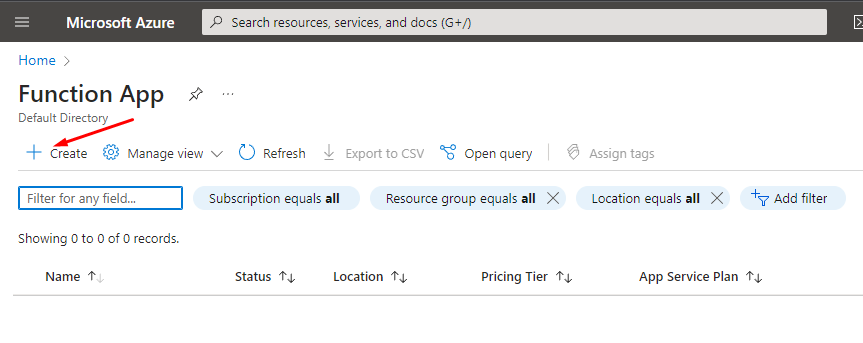
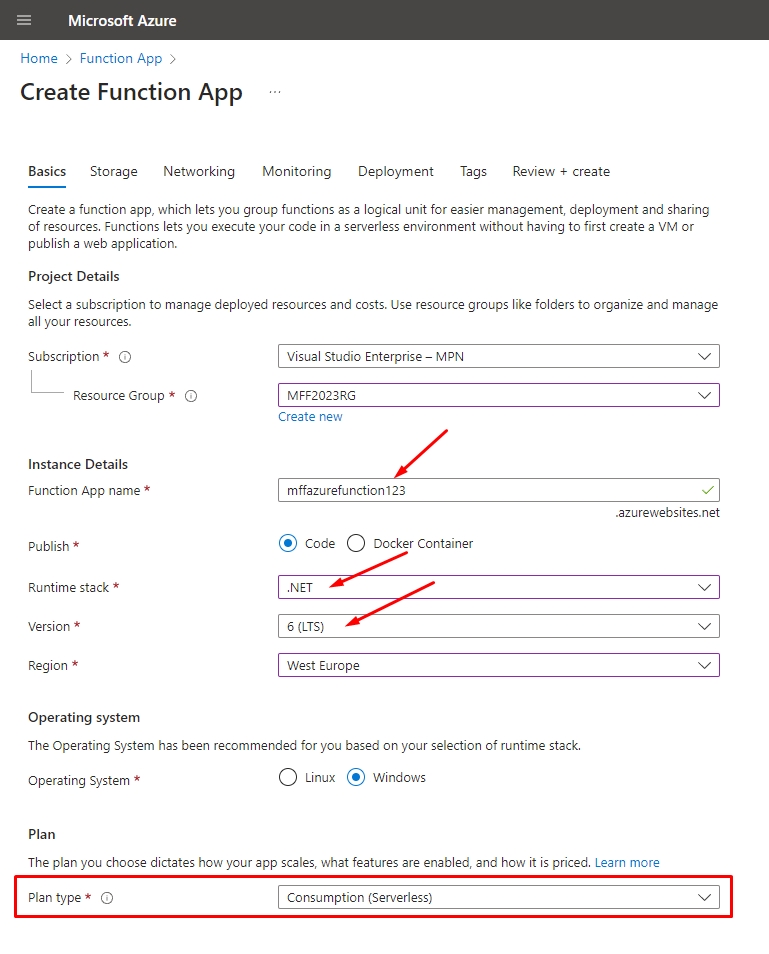
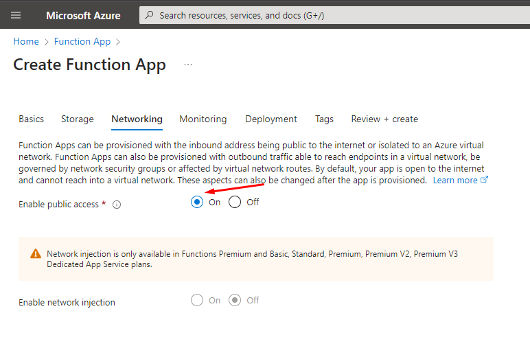

2. Ujistěte se, že ve Visual Studiu máte Azure Development workload 

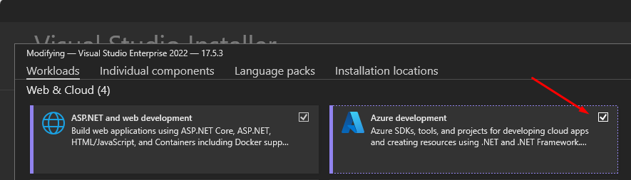

3. Založte projekt ve Visual Studiu se šablonou Azure Function

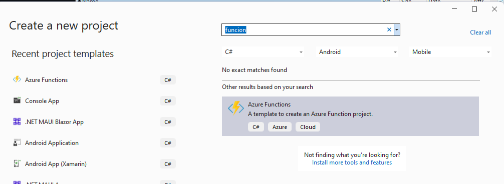
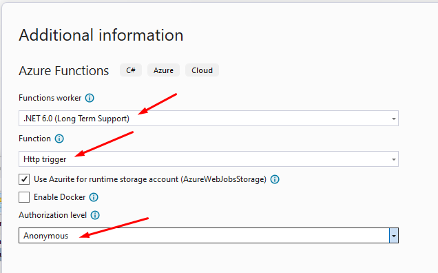

4. Můžete použít [přiložený kód](ZodiacFunction/ZodiacFunction.cs)

5. Lokálně funkci otestujte v prohlížeči. Prozkoumejte, jak se volání chová při neplatném datumu URL. 
[Optional] Zkuste odeslat POST požadavek místo GET. Datum použijte v těle

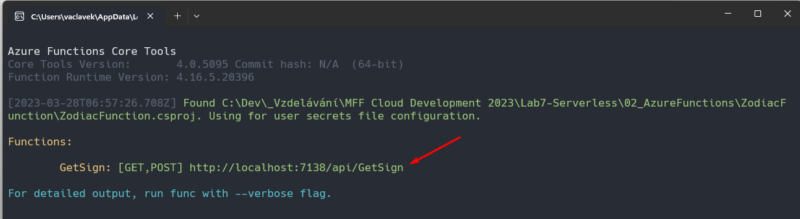
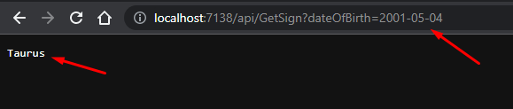

6. Vypublikujte projekt do MS Azure

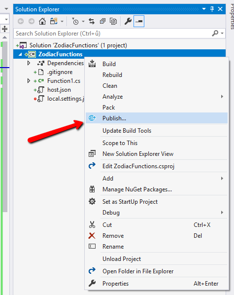
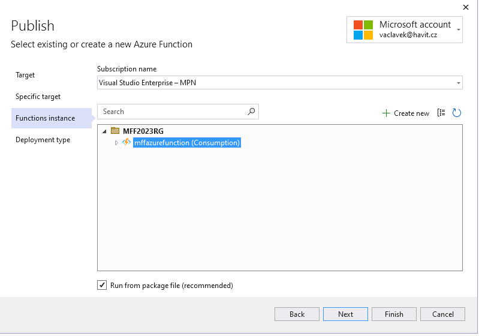
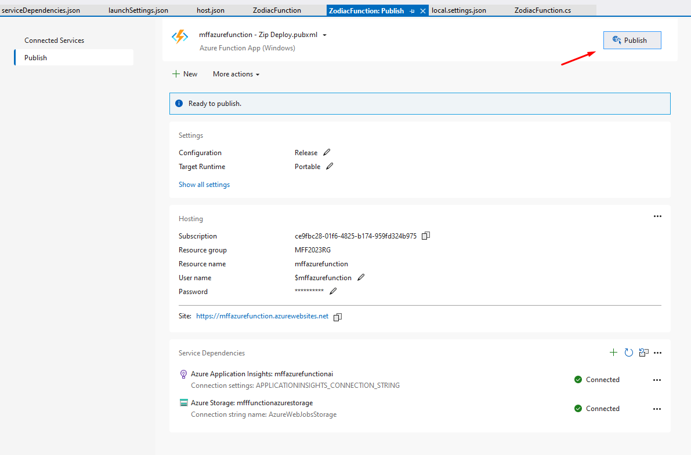

7. Prozkoumejte Azure portál, najděte URL Azure Funkce a zkuste ji zavolat "v produkci"

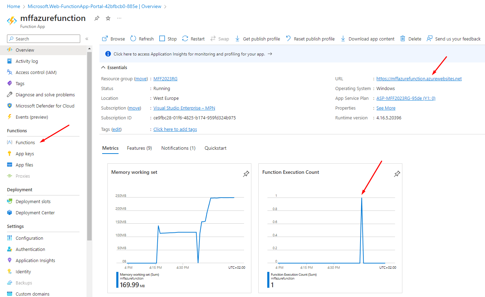

