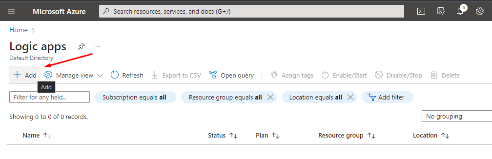
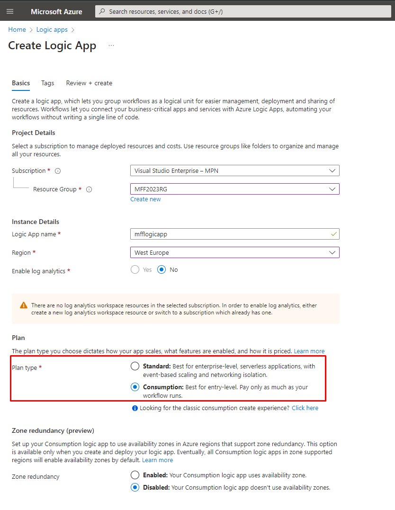
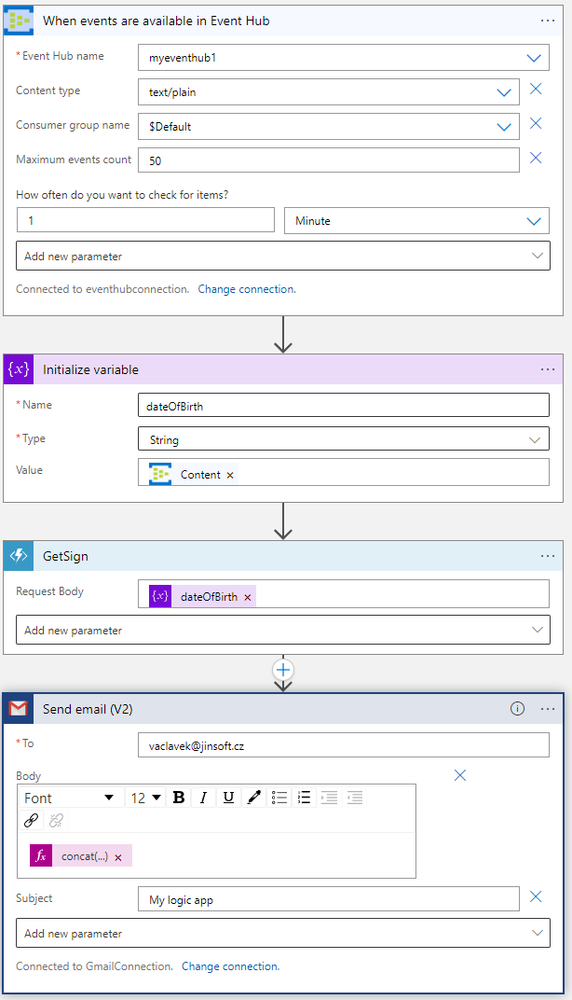
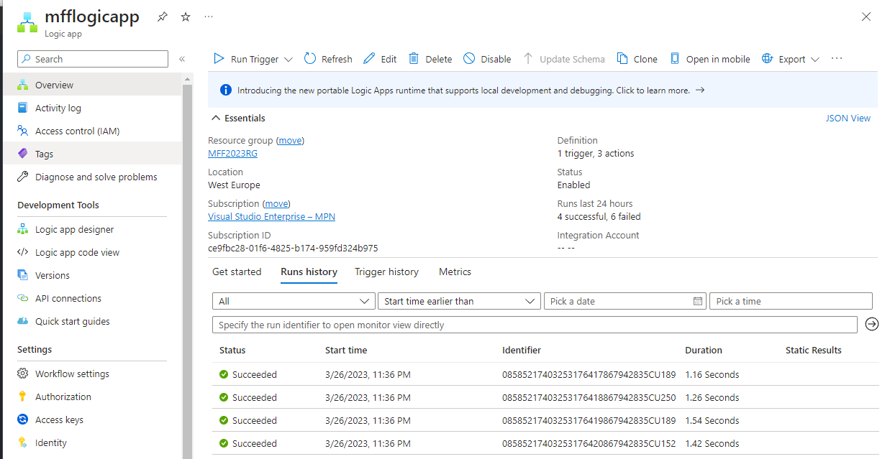
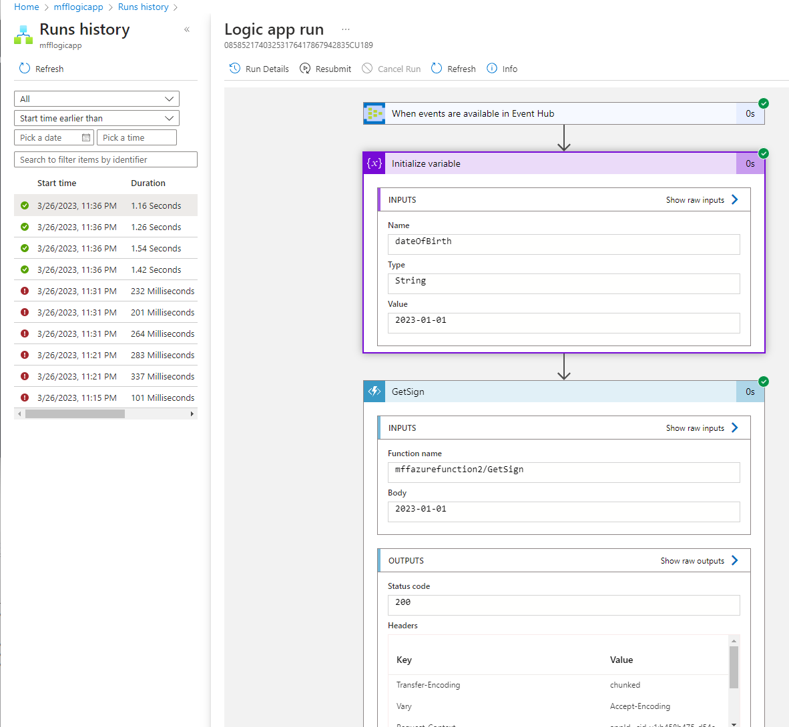

# LAB 7 - Logic Apps

*Zadání: Založte Logic App, která přijme signál z našeho Event Hubu, zavolá naši Azure Function a výsledek pošle e-mailem. Prozkoumejte v Azure Portále spuštěnou Logic App*

1. Založte Logic App v Azure Portále. Zvolte Consumption pricing plán (kvůli pricingu)

2. Založte nové Workflow takto:
- Event Hub přijme událost
- Založte novou proměnnou, do které uložíte obsah události
- Azure Function jsou předána data z události
- E-mailem se odešle výsledek funkce

3. Ověřte, že se workflow spouští, když se objeví události. Ověřte, že Vám přišel e-mail.

4. Prozkoumejte spuštěné workflow a jaké hodnoty jím putovaly

5. [OPTIONAL] Můžete vyzkoušet vytvořit Logic App přímo z Visual Studia a publikovat ji.
Potřebné závislosti:
- Visual Studio 2015 or 2017 or 2019 (!)
- Microsoft Azure SDK (2.9.1 or later)
- Azure Logic Apps Tools for VS 2017 (or 2015)