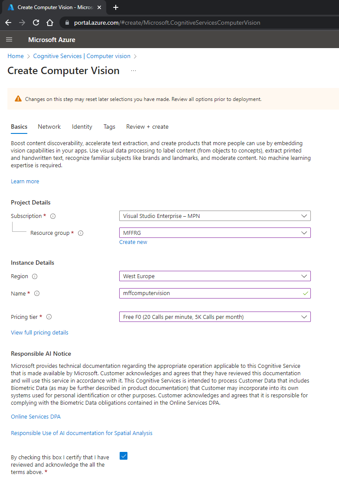
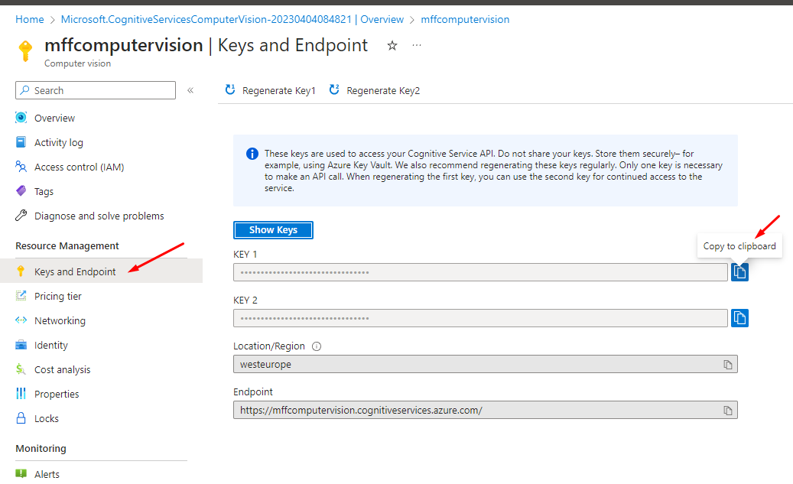
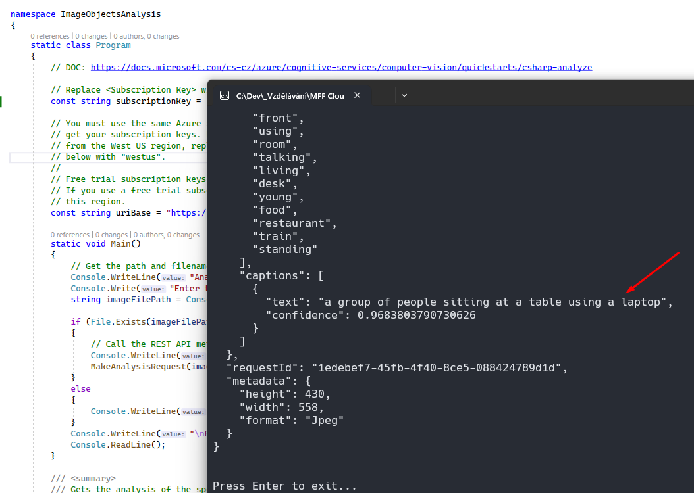
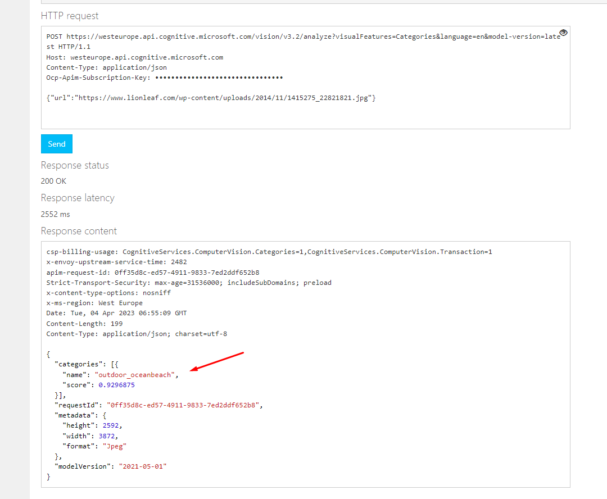

# LAB 8a - Image Objects Analysis

*Zadání: Proveďte analýzu obrázku pomoci v Computer Vision a službu vyzkoušejte.*

1. V Azure Portále najděte založte nový resource Computer Vision

2. Najděte přístupový klíč

3. Klíč použijte v přiložené aplikaci pro detekci obrázků. Použijte vlastní obrázky.

4. Vyzkoušejte také [konzoli](https://westeurope.dev.cognitive.microsoft.com/docs/services/computer-vision-v3-2/)

5. Určitě nezapomeňte vyzkoušet [Vision studio](https://portal.vision.cognitive.azure.com/)