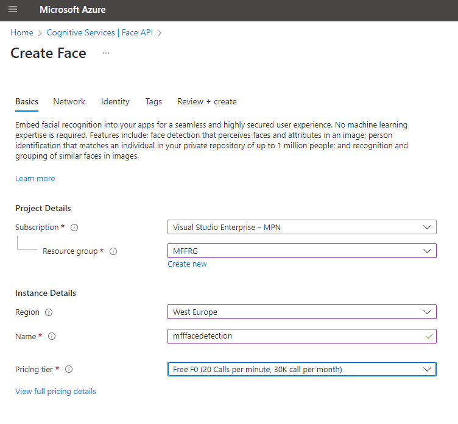

# LAB 8c - Face Detection

*Zadání: Vyzkoušejte službu Face Detection a nechte ji detekovat Váš obličej, co se dozvíte.*

1. V Azure Portále najděte založte nový resource Face API

2. Vytvořte nový klíč a použijte jej v přiložené aplikaci

3. Pozor - funkcionalita je limitována a dle nových pravidel nově vytvořené aplikace musí projít manuálním schválením a všechny atributy vztahující se  k identifikaci konkirétních osob, rasy, pohlaví a vyznání služba ve výchozím stavu blokuje. Po schválení mohou být výsledky tyto:

4. Vyzkoušejte, co vrací služba s limitovaným přístupem v přiložené aplikaci.

5. Prozkoumejte další možnosti v dokumentaci [1](https://learn.microsoft.com/en-us/azure/cognitive-services/computer-vision/quickstarts-sdk/identity-client-library?tabs=visual-studio&pivots=programming-language-csharp) a [2](https://learn.microsoft.com/en-us/azure/cognitive-services/computer-vision/how-to/identity-detect-faces)
